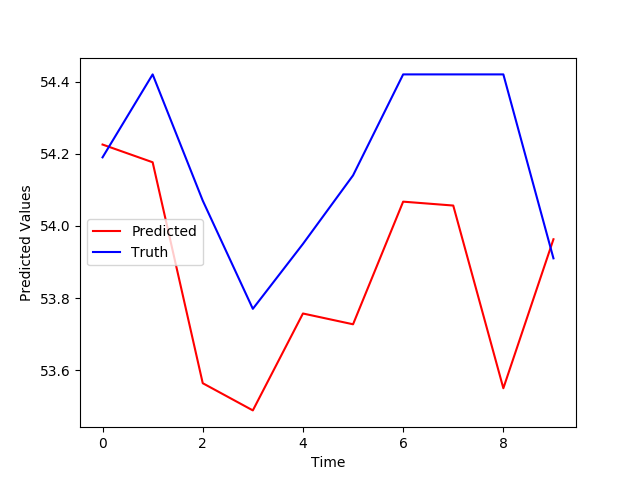

# Univariate-Stock-Price-Predictor
A case study of Recurrent Neural Networks (RNN) to analyze Time Series using Tensorflow

## The Data
The dataset was taken from https://www.nasdaq.com/market-activity/stocks/ko/historical using the 6 month history time frame in January 19th, 2020.

## Problem Transformation to a Time Series prediction problem
To do that, the file **cocacola_prepare.py** was used. It takes the downloaded dataset (named *Cocacola_stock.csv*) and generates the prepared version using 20 time steps.

> python cocacola_prepare.py

## Training, Evaluation and Results
To train, simply run **cocacola_network.py**.
After training, the network has a mean squared error of **0.007**.

The RNN was used to predict 10 days of stock prices using only the closing price of the stocks. These were the results.

To an univariate RNN, even though the prediction was 'low-balled', the gradient was predicted correctly.